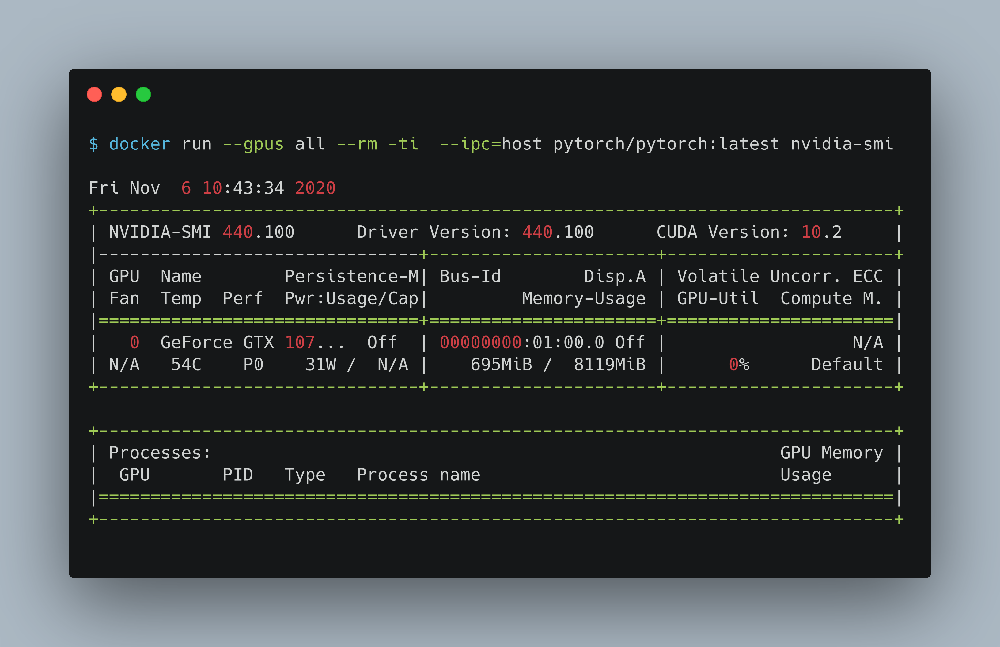
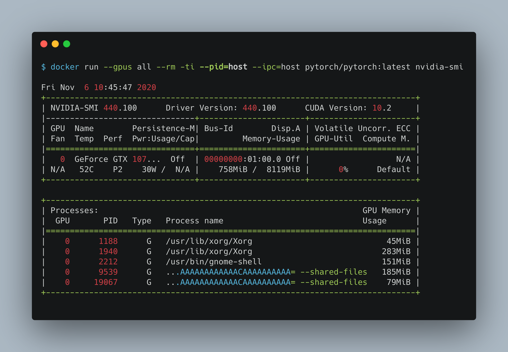

Note: The following notes are useful for a local ML/DL workflow (no notes on security, deployment).

# Installing docker

## Install docker (Ubuntu 20.04)

Note: `sudo snap install docker` has proven difficult to make work!

```bash
sudo apt install docker.io
sudo groupadd docker
sudo usermod -aG docker soumendra
newgrp docker
sudo docker run hello-world
```

```bash
sudo apt install docker-compose
```

## Install GPU support (nvidia dockers for Ubuntu 20.04)

```bash
distribution=$(. /etc/os-release;echo $ID$VERSION_ID)
curl -s -L https://nvidia.github.io/nvidia-docker/gpgkey | sudo apt-key add -
curl -s -L https://nvidia.github.io/nvidia-docker/$distribution/nvidia-docker.list | sudo tee /etc/apt/sources.list.d/nvidia-docker.list
```

```bash
sudo apt-get update
sudo apt-get install -y nvidia-container-toolkit
sudo systemctl restart docker
```

## Testing GPU support

We need to install nvidia driver in the host OS separately.

### Test nvidia-smi with the latest official CUDA image

```bash
docker run --gpus all nvidia/cuda:10.0-base nvidia-smi
```

### Pull an image with `cudnn`

```bash
docker pull nvidia/cuda:10.2-cudnn7-runtime
```

### Start a GPU enabled container on two GPUs

```bash
docker run --gpus 2 nvidia/cuda:10.0-base nvidia-smi
```

# Using docker

## Docker commands

* `docker run`: Run a docker container
* `docker build`: Build a docker image from a given Dockerfile
* `docker ps`: See all running docker processes
* `docker events`: 
* `docker stop`: 
* `docker rm -f`: 
* `docker info`: 
* `docker-inspect`: 

## Useful `docker run` options

https://docs.docker.com/engine/reference/run/

### Basics

* `-i`: Keep STDIN open even if not attached
* `-t`: Allocate a pseudo-tty
* For interactive processes (like a shell), you must use `-i` `-t` together in order to allocate a tty for the container process.
* `--rm`: Automatically remove the container when it exits. Set it to `false` (default) if you want the containor's file system persisted for debugging/inspection.
  - annonymous volumes (mounted without `-v` flag will also be removed).
* `--name`: Specify the name that can be used to identify the container instead of long or short UUID
* `--network none`: Disables all incoming and outgoing networking (useful when benchmarking)
* `--restart`
  - `no` (default)
  - `on-failure[:max-retries]` (keep a daemon/server process alive)
  - `always` (keep a daemon/server process alive)
  - `unless-stopped` (keep a daemon/server process alive)

### Specifying container resources

Useful mostly when benchmarking, so that we know what resources are being used. May need to feedle with these to get mutithreaded apps going.

* `--shm-size=""`
  - Size of `/dev/shm`.
  - The format is `<number>[<unit>]` (num>0, unit: `b`, `k`, `m`, `g`).
  - default `64m`
  - *useful for running `pytorch` with multithreaded data loaders*
* `-m, --memory=""`
  - Memory limit.
  - The format is `<number>[<unit>]` (num>0, unit: `b`, `k`, `m`, `g`).
  - default: `inf`
* `--memory-swap=""	`
  - Memory limit
  - The format is `<number>[<unit>]` (num>0, unit: `b`, `k`, `m`, `g`).
  - default: `inf`
* `-c, --cpu-shares=0`: CPU share between all running containers when running multiple containers (relative weight, default 1024 (same as 0))
* `--cpus=0.000`: Number of CPUs. Number is a fractional number. 0.000 means no limit.
* `--cpuset-cpus=""`: CPUs in which to allow execution (0-3, 0,1)

### Logging

Find the current default logging driver for the Docker daemon:

```bash
docker info --format '{{.LoggingDriver}}'
```

The default is usually `json-file`. To find the current logging driver for a running container:

```bash
docker inspect -f '{{.HostConfig.LogConfig.Type}}' <CONTAINER_NAME_OR_ID>
```

`json-file` is great for logging, can be specified with `--log-driver json-file`. Other options include `none` (`docker logs` won't be available) and `syslog`.

Use logging in non-blocking mode, which adds a buffer (specify a buffer size) that drops messages under pressure (overflow), which is preferrable to things getting blocked due to logging (more: https://docs.docker.com/config/containers/logging/configure/): `--log-opt mode=non-blocking --log-opt max-buffer-size=4m`.

### Entrypoint (TODO)

* https://docs.docker.com/engine/reference/run/#entrypoint-default-command-to-execute-at-runtime

### Exposing incoming ports (TODO)

* https://docs.docker.com/engine/reference/run/#expose-incoming-ports

### Mounting and using volumes (TODO)

* https://docs.docker.com/engine/reference/run/#volume-shared-filesystems

### Setting and using a working directory (TODO)

* https://docs.docker.com/engine/reference/run/#workdir

## How to debug containers with `--pid`

* Process namespace
  - Process (PID) namespace provides separation of processes.
  - The process namespace removes the view of the system processes, and allows process ids to be reused including pid 1.
  - A new container can
    - share the process namespace of a running container and can thus run `htop`, `nvidia-smi`, or other debugging/diagnostic tools.
    - share the host's process namespace, allowing processes within the container to see all of the processes on the system.

### Example of running `nvidia-smi` in host's process namespace

In the first example, we run a container in its own process namespace (default behaviour). As we can see, it doesn't report any running gpu processes because it isn't running any.



When we run the same container by asking it to share host's process namespace and then run `nvidia-smi`, it reports gpu processes running in the host os.



# Deep learning with docker

## Installing tensorflow with docker

### Start a bash session using TensorFlow's latest release

```bash
docker pull tensorflow/tensorflow:latest-gpu-jupyter
docker run -it --rm tensorflow/tensorflow:latest-gpu-jupyter bash
```

### Start a Jupyter Notebook server using TensorFlow's latest release

```bash
docker run -it -p 8888:8888 tensorflow/tensorflow:latest-gpu-jupyter
```

## Installing pytorch with docker

* https://github.com/pytorch/pytorch#docker-image

```bash
docker run --gpus all --rm -ti --ipc=host pytorch/pytorch:latest nvidia-smi
```

Note:
* PyTorch uses shared memory to share data between processes.
* So, if torch multiprocessing is used (e.g. for multithreaded data loaders), the default shared memory segment size that container runs with is not enough.
* You should increase shared memory size either with
    - `--ipc=host` or
    - `--shm-size`.


## Using deepo for deep learning workflow

* https://github.com/ufoym/deepo
